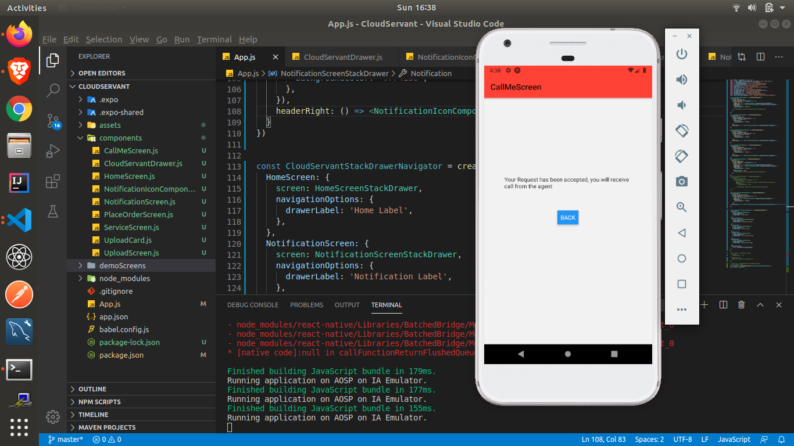
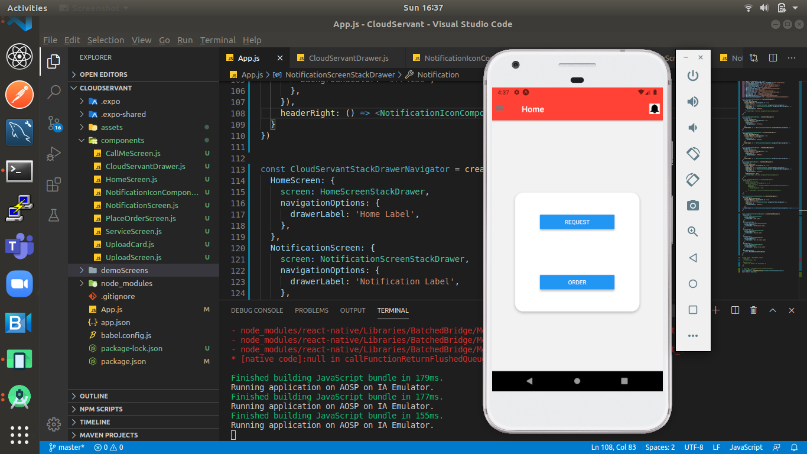
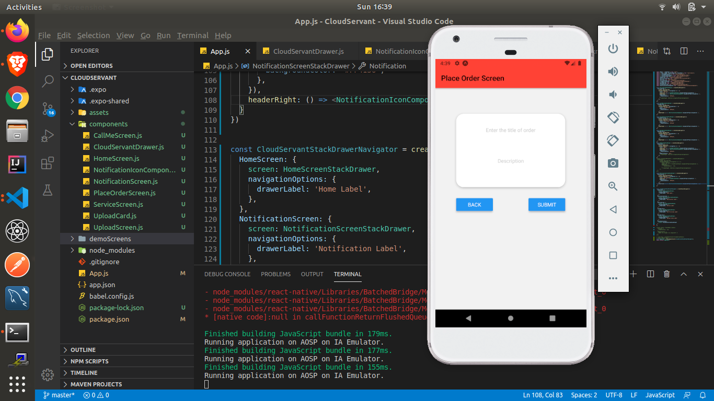
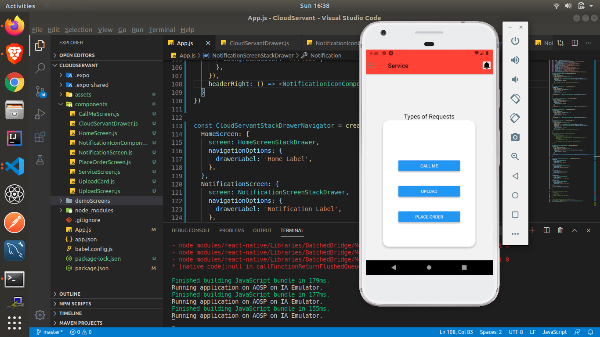

### Cloud Servant

### Cloud powered React Native Application 

### Procedure to setup
type: 
```bash
npm i 
```

### Screens
* **CallMeScreen**
<p align="center">
  
</p>

* **HomeScreen**
<p align="center">
  
</p>

* **PlaceOrderScreen**
<p align="center">
  
</p>

* **ServiceScreen**
<p align="center">
  
</p>

* **UploadScreen**
<p align="center">
  
</p>
